Running GUI app through containers is a bit of challenge. It becomes more challenging when the app requires OpenGL support.

After digging a lot on the web, I seem to find a solution. I am noting my solution here for everyone.

Table of Contents
=================

   * [Docker](#docker)
      * [Build container](#build-container)
      * [Push the container](#push-the-container)
      * [Pull the container](#pull-the-container)
      * [Run the container](#run-the-container)
         * [Linux/MAC](#linuxmac)
            * [Isolated way](#isolated-way)
            * [Hacky way](#hacky-way)
         * [Windows](#windows)
      * [Docker references](#docker-references)
      * [Docker known issues](#docker-known-issues)
   * [Singularity](#singularity)
      * [Build image](#build-image)
      * [Push the image](#push-the-image)
         * [Linux/MAC](#linuxmac-1)
            * [Pull the image](#pull-the-image)
            * [Run the image](#run-the-image)
         * [Windows](#windows-1)
            * [From CentOS7 ISO (recommended)](#from-centos7-iso-recommended)
            * [From standard CentOS7 box](#from-standard-centos7-box)
            * [Pull the image](#pull-the-image-1)
            * [Run the image](#run-the-image-1)
      * [Singularity references](#singularity-references)
      * [Singularity known issues](#singularity-known-issues)
   * [Useful tips](#useful-tips)
      * [1. Enable/Disable Hyper-V](#1-enablediable-hyper-v)
      * [2. Display for root](#2-display-for-root)
      * [3. 3D acceleration](#3-3d-acceleration)
      * [4. X forwarding on Windows host](#4-x-forwarding-on-windows-host)

Table of Contents created by [gh-md-toc](https://github.com/ekalinin/github-markdown-toc)


# Docker

Running GUI apps on Docker containers is relatively easier in the sense that it doesn't require a GUI desktop. You should 
be able to forward X11 configuration from the host and run GUI apps on the container smoothly. 

## Build container

Neither `mesa-dri-drivers` nor `mesa-libGL` library could provide compatible environment for display 
in a docker container. Hence, I had to install `NVIDIA-Linux-x86_64-430.40.run` driver. See the full list of 
NVIDIA drivers at [https://www.nvidia.com/en-us/drivers/unix/]().

> docker build -t glxgears-docker -f Dockerfile .

## Push the container
    
    docker tag -t glxgears-docker tbillah/glxgears-docker
    docker login
    docker push tbillah/glxgears-docker

## Pull the container

> docker pull tbillah/glxgears-docker

## Run the container

### Linux/MAC

#### Isolated way

> docker run --rm -ti -v /tmp/.X11-unix:/tmp/.X11-unix -e DISPLAY=$DISPLAY --privileged glxgears-docker glxgears

Or get in the container first and then run `glxgears`:

    docker run --rm -ti -v /tmp/.X11-unix:/tmp/.X11-unix -e DISPLAY=$DISPLAY  --privileged glxgears-docker
    (inside the docker container) glxgears

`--privileged` enables `direct rendering` required for `glxgears`. Before forwarding the `DISPLAY` port like above, 
`xhost +` might be necessary:

>  xhost +

    access control disabled, clients can connect from any host

#### Hacky way

I was able to run `glxgears` on docker container and Linux host by mounting the whole `/usr/lib64` directory without having to install 
any NVIDIA or mesa drivers on the container:

> docker run --rm -ti -v /tmp/.X11-unix:/tmp/.X11-unix -v /usr/lib64:/usr/hostLib64 -e DISPLAY=$DISPLAY 
-e LD_LIBRARY_PATH=/usr/hostLib64 --privileged glxgears-docker glxgears


### Windows

1. Install X server [https://sourceforge.net/projects/vcxsrv/]() and have it running in the background.

You must uncheck the `Native opengl` option that exports `LIBGL_ALWAYS_INDIRECT` variable. Checking 
`Disable access control` might be necessary. See the image below:

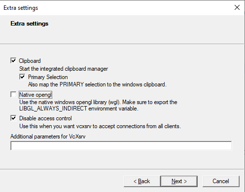

Finally, save the configuration file:

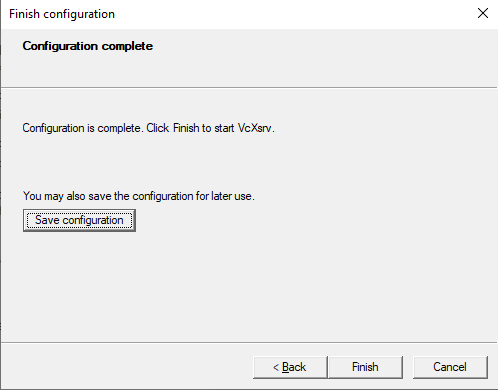


2. Launch Docker Desktop. See a few important settings below:

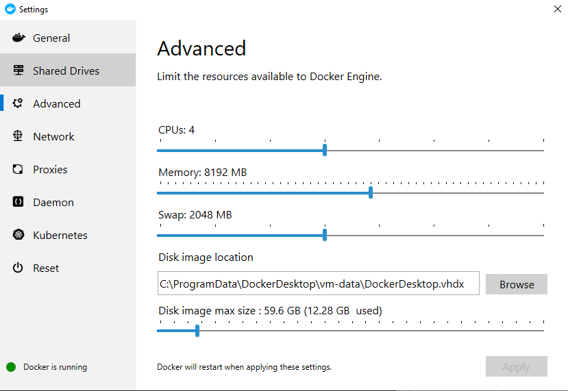

-
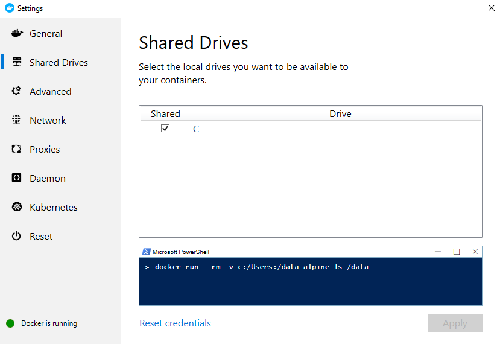


3. Launch Windows PowerShell. I DIDN'T require to launch PowerShell with `Run as administrator`.
 
4. Obtain your IP address:

> ipconfig

	Wireless LAN adapter Wi-Fi:

	   Connection-specific DNS Suffix  . : partners.org
	   Link-local IPv6 Address . . . . . : fe80::111e:3245:4393:ed21%24
	   IPv4 Address. . . . . . . . . . . : 10.22.138.136
	   Subnet Mask . . . . . . . . . . . : 255.255.248.0
	   Default Gateway . . . . . . . . . : 10.22.136.1

`IPv4` should be your IP address. The above command should print a bunch of IPv4 addresses. Any of them can be used. 
Moreover, you won't need an active internet connection to enable display in a docker container.


5. Set up DISPLAY variable in the PowerShell:

> Set-Variable -name DISPLAY -Value 10.22.138.136:0.0

6. Finally:

> docker run --rm -ti -e DISPLAY=$DISPLAY --privileged glxgears-docker glxgears

Or get in the container first and then run `glxgears`:

    docker run --rm -ti -e DISPLAY=$DISPLAY --privileged glxgears-docker
    (inside the docker container) glxgears


## Docker references

1. http://gernotklingler.com/blog/docker-replaced-virtual-machines-chroots/

2. http://wiki.ros.org/docker/Tutorials/GUI

3. https://dev.to/darksmile92/run-gui-app-in-linux-docker-container-on-windows-host-4kde


## Docker known issues

1. https://github.com/NVIDIA/nvidia-docker/issues/586

2. https://github.com/NVIDIA/nvidia-docker/issues/136

3. Upon closing `fsleyes`:

```
    (fsleyes:203): Gdk-ERROR **: 16:01:14.549: The program 'fsleyes' received an X Window System error.
    This probably reflects a bug in the program.
    The error was 'GLXBadCurrentWindow'.
      (Details: serial 95219 error_code 159 request_code 149 minor_code 5)
      (Note to programmers: normally, X errors are reported asynchronously;
       that is, you will receive the error a while after causing it.
       To debug your program, run it with the --sync command line
       option to change this behavior. You can then get a meaningful
       backtrace from your debugger if you break on the gdk_x_error() function.)
    /root/fsl-5.0.11-centos7/bin/fsleyes: line 6:   202 Trace/breakpoint trap   ${FSLDIR}/bin/FSLeyes/fsleyes $@
```

This issue didn't affect anything I know of, so I labeled this as *Won't Fix*.

4. Since there is no way to reboot a docker container, NVIDIA driver won't load properly. Rather, it would only 
provide libraries required to run `glxgears` or `fsleyes`. Hence, commands like below run into errors:

> nvidia-smi

`NVIDIA-SMI has failed because it couldn't communicate with the NVIDIA driver. Make sure that the latest NVIDIA driver is installed and running.`

However, I was able to eliminate this error by installing a version of NVIDIA driver on docker container that matches 
with my host machine. Again, See the full list of NVIDIA drivers at [https://www.nvidia.com/en-us/drivers/unix/](). 


# Singularity

Singularity containers i.e. "sylabs/singularity-3.3-centos-7-64" don't come with GUI enabled. You may forward X11 from 
windows host by means of an X server. This approach worked fine for lightweight apps like `xclock` and `xeyes` but 
wasn't able to run OpenGL hungry apps like glx-gears. So, the most manageable way of running OpenGL apps on 
Singularity containers should be through a GUI desktop.
 


## Build image

> singularity build xclock-glxgears Singularity

## Push the image

1. Create new access token, give it a nice name i.e. tuna-salad

[https://cloud.sylabs.io/auth]()
    
2. Copy the access token into your clipboard. Save the access token to `~/.singularity/sylabs-token` file for future use.
    
3. Login to Singularity cloud:


    singularity remote login SylabsCloud
        
When asked, just paste the access token. After login is complete, you should be able to push your images to Singularity Cloud:
    
    singularity push tuna-image library://tbillah/collection/tuna-image:0.0.0
    
4. Before pushing an image, you will be asked to sign and verify it. Follow the link below to be able to do that:


    https://sylabs.io/guides/3.0/user-guide/signNverify.html
    
But, you can push an unsigned image with '-U' flag:
    
    singularity push -U ~/Documents/tuna-image library://tbillah/collection/tuna-image:0.0.0


### Linux/MAC

Running OpenGL apps on singularity container for a Linux/MAC host is easier than running on docker container.

#### Pull the image
    
    singularity pull library://tbillah/collection/xclock-glxgears
    
#### Run the image

    singularity shell --writable-tmpfs xclock-glxgears
    (inside the singularity shell) glxgears
    
You can also use `--nv` flag to export host NVIDIA libraries. In this case, you wouldn't need another `mesa-dri-drivers` 
when you build the container.

### Windows

Download Oracle VirtualBox from [here](https://www.virtualbox.org/wiki/Downloads). 

#### From CentOS7 ISO (recommended)

1. Download a complete CentOS7 image from your [preferred mirror](http://isoredirect.centos.org/centos/7/isos/x86_64/). 


2. Open *Oracle VM VirtualBox Manager* and create a new *Virtual Machine*.
Allocate memory and other resources as you see like. You can choose dynamic allocation. 
See important steps below (there should be other steps in between):

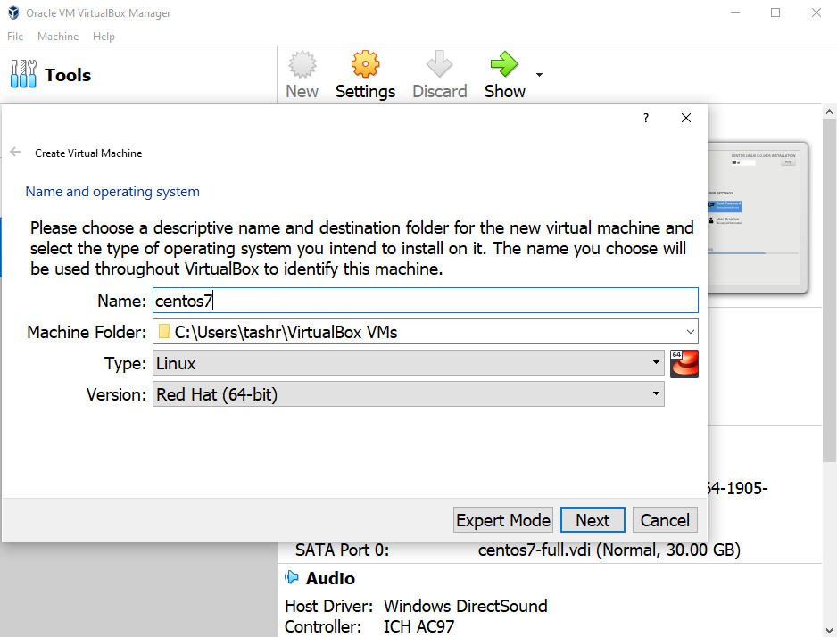

-
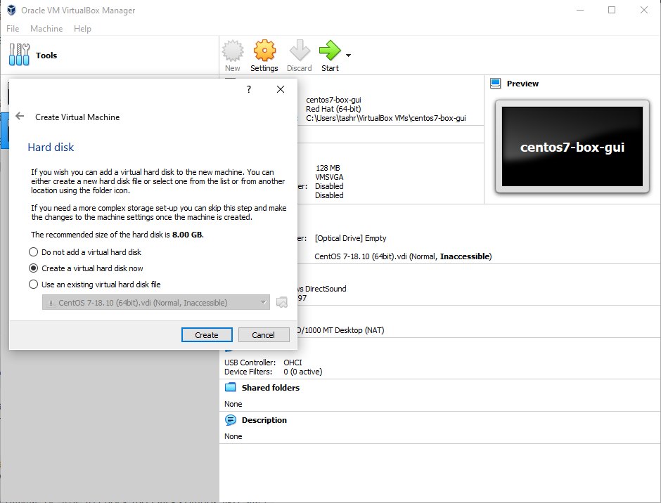

-
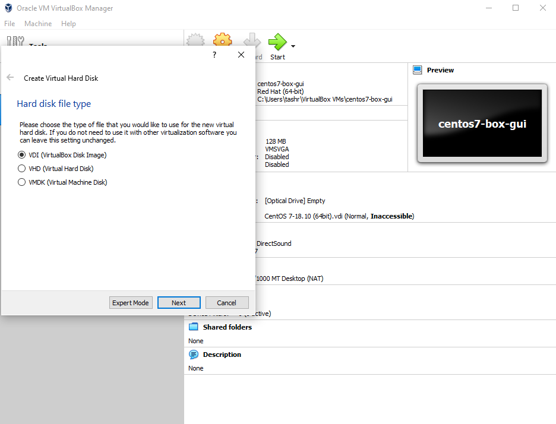


3. Start the virtual machine, provide the ISO you downloaded.

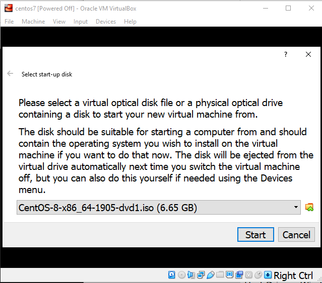


4. CentOS7 installation requires little user intervention. You need to *Select the device*, 
switch *ON* internet connection, and create *ROOT PASSWORD*. The rest of the settings could be left as 
they are. See important steps below (there should be other steps in between):


-

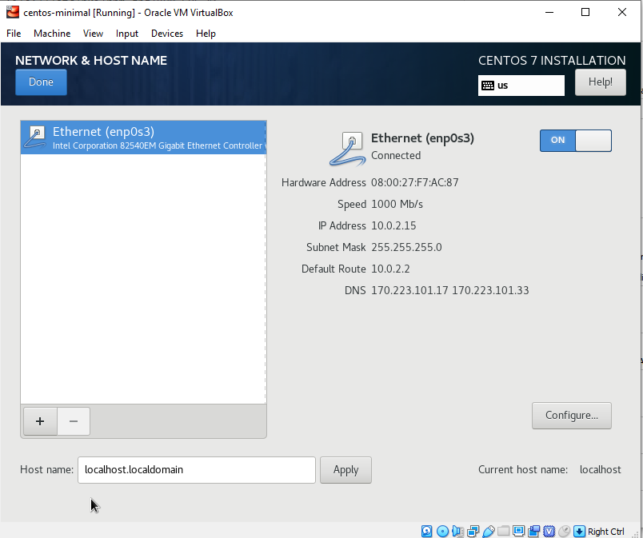
-

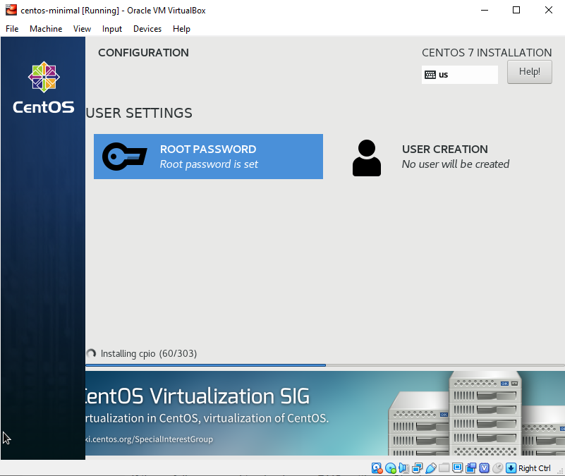


5. After *initramfs* creation is complete, the machine should reboot itself. The Virtual Machine should 
automatically eject the ISO you provided. However, if it does not and upon reboot it goes back to 
CentOS installation prompt, eject the ISO manually:

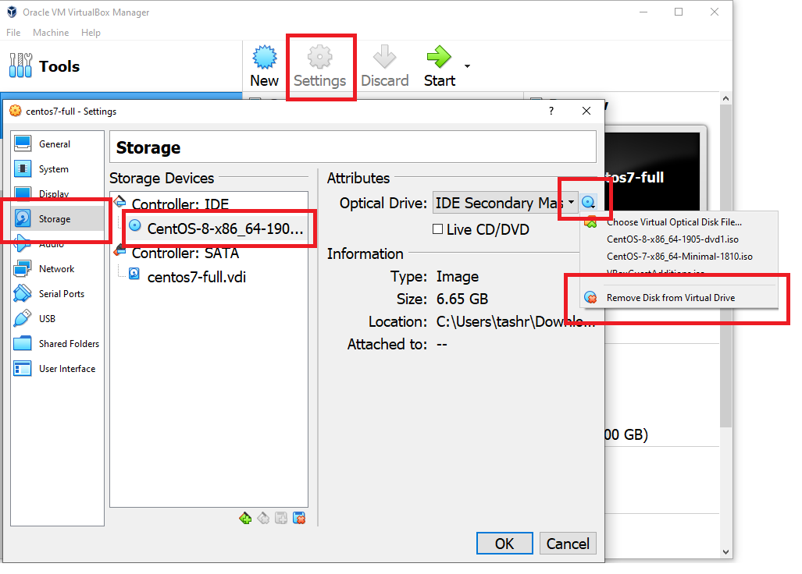

Now *Start* your virtual machine again.


6. After successful installation of CentOS7, open a terminal on GUI desktop, switch to root, 
and install the following:
    
    
    sudo su -
    yum -y install epel-release
    yum -y install singularity
    exit

    

#### From standard CentOS7 box

This section is put here for learning purpose:

1. Install Vagrant for Windows [https://www.vagrantup.com/downloads.html]()
2. Install Vagrant manager for Windows [http://vagrantmanager.com/downloads/]()

3. Launch *Windows PowerShell* and do the following:


    mkdir gui-container
    New-Item Vagrantfile


Save the following configuration in the *Vagrantfile*
    
    Vagrant.configure("2") do |config|
        
        config.vm.box = "centos/7"
        config.vm.provider "virtualbox" do |v|
          v.gui = true
          v.memory = 2048
          v.cpus = 2
        end
    
    end  


4. Keep *Oracle VM VirtualBox Manager* running in the background and start the virtual machine defined by 
*Vagrantfile*:
    
    
    vagrant up
    vagrant ssh


Once in the Virtual Machine, open a terminal, switch to root, and install the following:
    
    sudo su -
    
    yum -y groupinstall 'gnome desktop'
    yum -y install 'xorg*'
    yum -y install epel-release
    yum -y install singularity
    
    yum remove -y initial-setup initial-setup-gui
        
Now switch to GUI:

    systemctl isolate graphical.target
    systemctl set-default graphical.target

Upon doing the above, you should see GUI desktop in your virtual box window.
It may be useful to reboot at this point (from the host terminal):

    vagrant halt
    vagrant up


#### Pull the image

Finally, open a terminal on GUI desktop and pull the image:
   
    singularity pull library://tbillah/collection/xclock-glxgears
    
#### Run the image

    singularity shell --writable-tmpfs xclock-glxgears
    (inside the singularity shell) glxgears
    

## Singularity references
    
1. https://codingbee.net/vagrant/vagrant-enabling-a-centos-vms-gui-mode


## Singularity known issues

1. https://github.com/sylabs/singularity/issues/4290

 
# Useful tips

## 1. Enable/Disable Hyper-V

*Docker Desktop* requires Hyper-V enabled with *Oracle/Vagrant VirtualBox* requires it disabled.
Follow Microsoft documentation to do the required:
[https://support.microsoft.com/en-us/help/3204980/virtualization-applications-do-not-work-together-with-hyper-v-device-g]()

However, enabling/disabling Hyper-V required me to restart my machine twice instead of once asked.


## 2. Display for root

You usually log into Singularity container as `vagrant`. You might need to switch to root 
for running certain GUI applications. See the instruction below to set up display for root 
user:

(i) Obtain your display parameters

> echo $DISPLAY
    
    YOUR-DISPLAY-SOCKET

> xuath list
    
    YOUR-DISPLAY-COOKIE

(ii) Export display parameters to root

Now switch to root user:
    
> sudo su -

Add the display parameters for root user:
    
    export DISPLAY=${YOUR-DISPLAY-SOCKET}
    xauth add ${YOUR-DISPLAY-COOKIE}
    
Test display for root user now:

> xeyes
> glxgears


(iii) But, if you need to use GUI with *root* user, it may be useful to log out and log in as *root* directly. 
Use cases include running containers with root privileges. 

(iv) If needed, you may follow this suggestion to create *.XAuthority* files:

[https://superuser.com/questions/806637/xauth-not-creating-xauthority-file]()


## 3. 3D acceleration

Running fsleyes required me to disable 3D acceleration from *VirtualBox Manager Settings*:

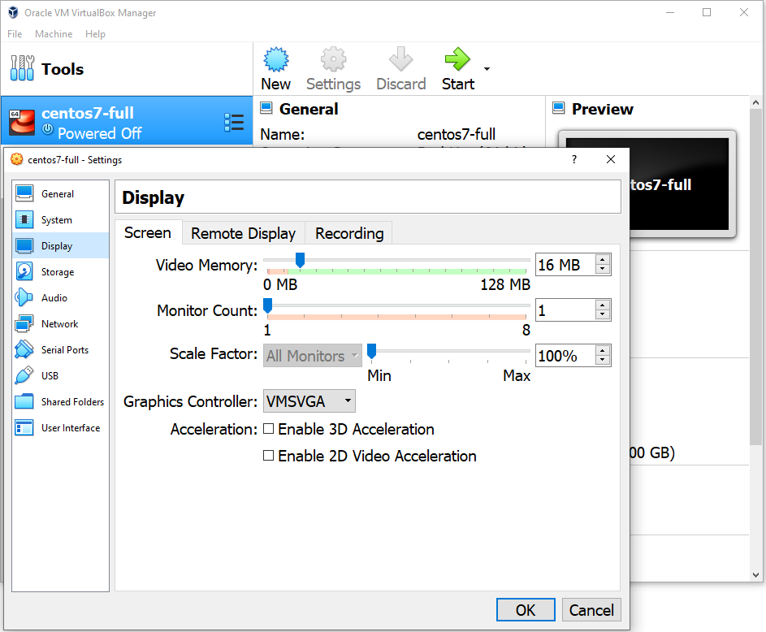


## 4. X forwarding on Windows host

You need to install [Git Bash](https://gitforwindows.org/) first. The following should be included to *Vagrantfile*:
    
    config.ssh.forward_x11 = true

Details can be found below:

[https://stackoverflow.com/questions/40056227/warning-no-xauth-data-using-fake-authentication-data-for-x11-forwarding]()

